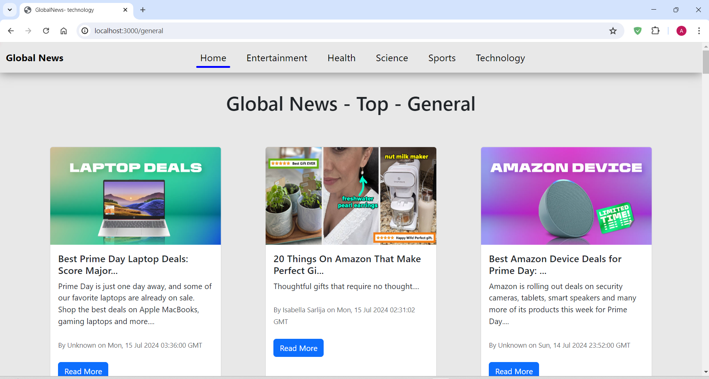

# News Web App

This is a news web app built using React.js, which fetches and displays news articles using an API. Below are some screenshots with explanations of the app's features.

## Home Page

The home page displays the latest news articles. Users can browse articles by category from the navigation bar.

## Category Navigation

Users can select different news categories from the navigation bar to filter articles accordingly.

## Article Card

Each article is presented in a card format with a title, summary, and a "Read More" button for detailed content.

## Detailed Article View

Clicking on "Read More" opens the full article, allowing users to read the complete content.

## Responsive Design

The app is fully responsive, providing a seamless user experience across devices, including desktops, tablets, and mobile phones.

## API Integration

The app fetches real-time news data from a reliable API, ensuring users receive the most up-to-date information.
